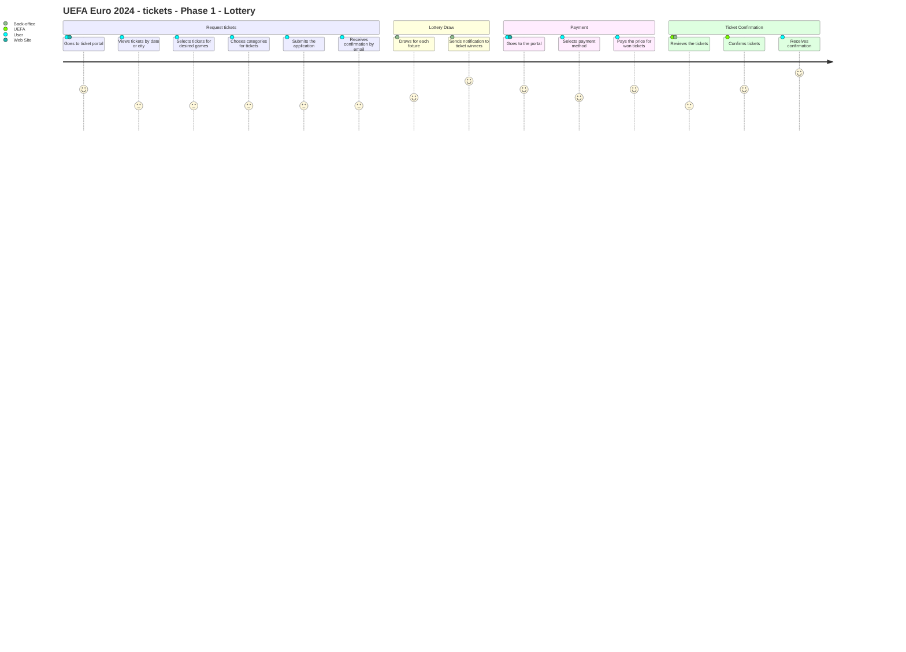

```mermaid
journey
    title UEFA Euro 2024 - tickets - Phase 1 - Lottery
    section Request tickets
        Goes to ticket portal: 5: User, Web Site
        Views tickets by date or city: 3: User
        Selects tickets for desired games: 3: User
        Choses categories for tickets: 3: User
        Submits the application: 3: User
        Receives confirmation by email: 3: User
    section Lottery Draw
        Draws for each fixture: 4: Back-office
        Sends notification to ticket winners: 6: Back-office
    section Payment
        Goes to the portal: 5: User, Web Site
        Selects payment method: 4: User    
        Pays the price for won tickets: 5: User
    section Ticket Confirmation
        Reviews the tickets: 3: UEFA, Back-office
        Confirms tickets: 5: UEFA
        Receives confirmation: 7: User
```