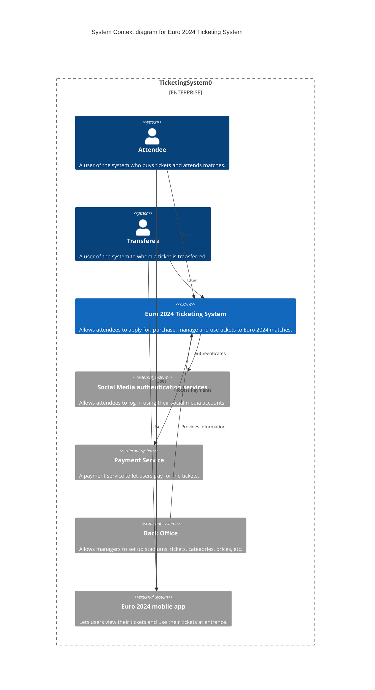
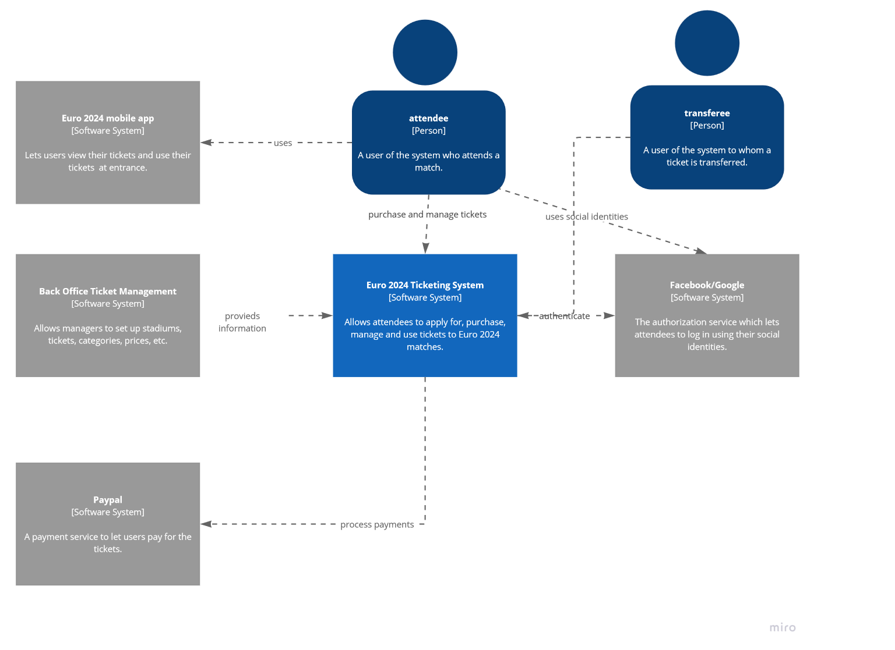

```mermaid
C4Context
      title System Context diagram for Euro 2024 Ticketing System
      Enterprise_Boundary(b0, "TicketingSystem0") {
        Person(UserA, "Attendee", "A user of the system who buys tickets and attends matches.")
        Person(UserT, "Transferee", "A user of the system to whom a ticket is transferred.")
        
        System(SystemT, "Euro 2024 Ticketing System", "Allows attendees to apply for, purchase, manage and use tickets to Euro 2024 matches.")
        System_Ext(SystemS, "Social Media authentication services", "Allows attendees to log in using their social media accounts.")
        System_Ext(SystemP, "Payment Service", "A payment service to let users pay for the tickets.")
        System_Ext(SystemB, "Back Office", "Allows managers to set up stadiums, tickets, categories, prices, etc.")
        System_Ext(SystemM, "Euro 2024 mobile app", "Lets users view their tickets and use their tickets at entrance.")


      }

      Rel(UserA, SystemT, "Uses")
      Rel(UserA, SystemM, "Uses")
      Rel(UserT, SystemT, "Uses")
      Rel(UserT, SystemM, "Uses")

      Rel(SystemT, SystemS, "Autheenticates")
      Rel(SystemT, SystemP, "Process Payments")
      Rel(SystemB, SystemT, "Provides Information")
```

