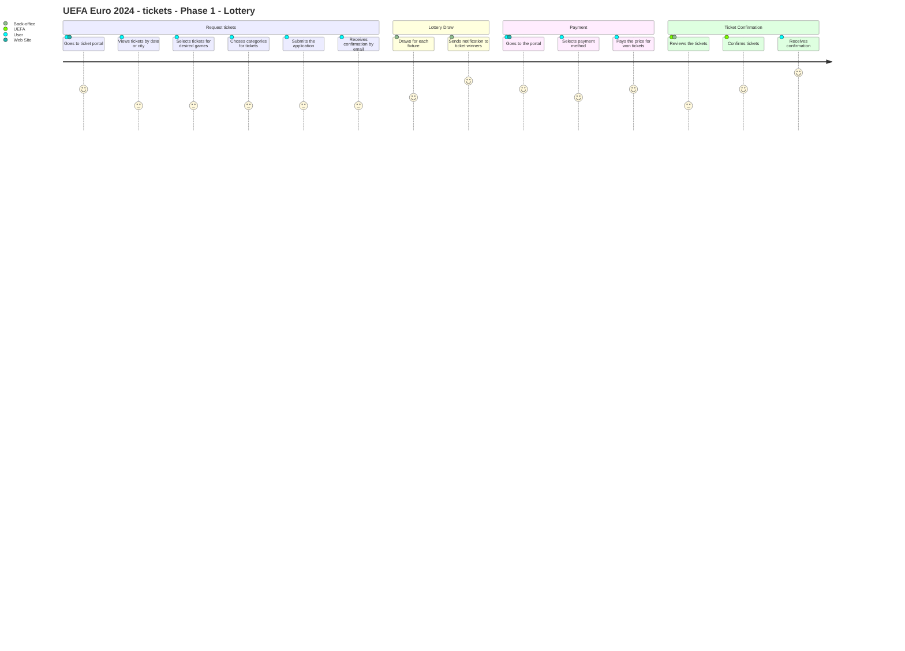

## User Registration and Authentication

1. New user signs up:
- User visits the Euro 2024 ticketing website
- Clicks "Register" and enters personal details (name, email, password)
- Verifies email address via confirmation link
- Completes profile with additional information (country, preferences)

2. Existing user logs in:
- User visits the ticketing website
- Enters email and password
- System authenticates credentials
- User accesses their account dashboard

3. Social media login:
- User clicks "Login with Facebook/Google"
- Authorizes the ticketing app to access social media profile
- System creates or links account using social media data
- User accesses their account dashboard

## Ticket Application - Phase 1 (Lottery)

1. User applies for tickets:
- Logs into account during application window
- Selects desired matches, ticket categories, and quantities
- Indicates willingness to accept different categories
- Submits application before deadline

2. Lottery results and payment:
- System conducts lottery draw after application window closes
- User receives email notification of lottery results
- If successful, user logs in and reviews allocated tickets
- Completes payment within specified timeframe (e.g., 48 hours)
- Receives confirmation of ticket purchase

## Ticket Purchase - Phase 2 (First Come, First Served)

1. User purchases available tickets:
- Logs into account during sales window
- Browses real-time ticket availability for matches
- Selects desired tickets and adds to cart
- Completes purchase within time limit (e.g., 10 minutes)
- Receives confirmation of ticket purchase

## Ticket Management (User)

1. User views purchased tickets:
- Logs into account
- Navigates to "My Tickets" section
- Views list of purchased tickets with details

2. User transfers a ticket:
- Selects ticket to transfer
- Enters recipient's email address
- Confirms transfer
- Recipient receives email notification and accepts transfer

3. User resells a ticket:
- Selects ticket to resell
- Sets resale price within allowed limits
- Lists ticket on official resale platform
- Receives notification when ticket is sold

## Ticket Delivery and Usage

1. User accesses digital tickets:
- Downloads official Euro 2024 mobile app
- Logs into account
- Views digital tickets in app wallet

2. User attends match:
- Arrives at stadium on match day
- Opens mobile app and selects appropriate ticket
- Presents digital ticket at entrance for scanning
- Gains admission to the event